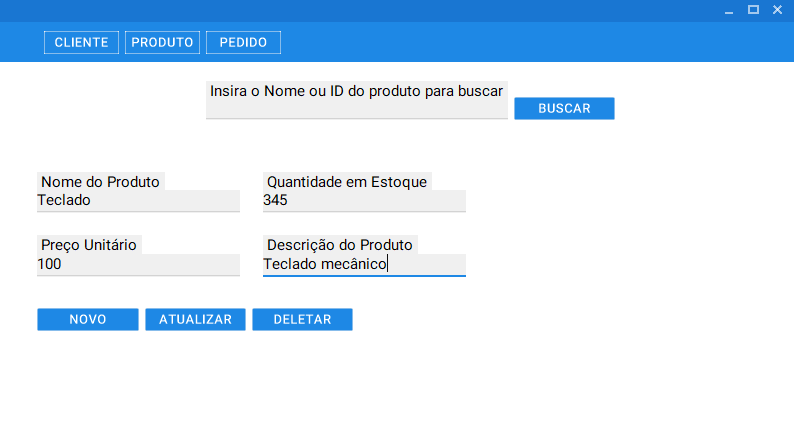
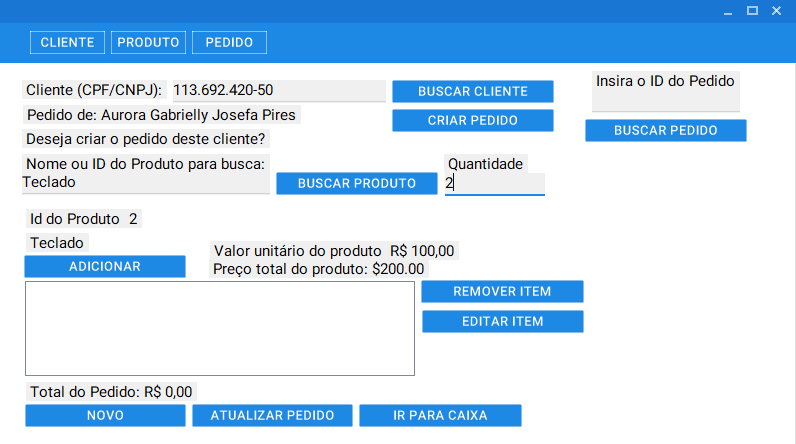

# Documentação do Sistema Gerenciador de Produto e Cliente

## 1. Introdução

O Sistema Gerenciador de Produto e Cliente é uma aplicação desenvolvida em C# utilizando Windows Forms no .NET Framework 4.6.2. Ele permite:

- Cadastrar, editar e remover clientes, incluindo informações como nome, endereço, telefone e e-mail.
- Cadastrar, editar e remover produtos, com dados como nome, descrição, preço e estoque.
- Realizar vendas, registrando o cliente, os produtos vendidos e a quantidade de cada item.
- Gerar relatórios de vendas, clientes e estoque.

---

## 2. Estrutura do Sistema

### 2.1. Modelagem de Pastas

A estrutura do código fonte foi organizada da seguinte forma:

```
/src
    /Data                     # Parte que lida com o banco de dados e APIs externas
        - DbConnection.cs     # Classe para realizar conexão com o banco de dados PostgreSQL
        - CepAPI.cs          # Classe para buscar informações de CEP na API Viacep

    /Enums                    # Enumerações para uso no sistema
        - ClientType.cs       # Tipos de cliente: Pessoa Física ou Jurídica
        - PaymentMethod.cs    # Formas de pagamento: Cartão, Boleto, etc.

    /Forms                    # Telas da aplicação
        - FormCashMovement    # Tela para gerenciar movimentações de caixa
        - FormClient.cs       # Tela para cadastrar e editar clientes
        - FormOrder           # Tela para criar e gerenciar pedidos
        - FormProduct         # Tela para cadastrar e editar produtos

    /Models                   # Classes que representam os dados do sistema
        - Address.cs          # Representa os dados de endereço
        - CashMovement.cs     # Representa as movimentações de caixa
        - CepResponse.cs      # Representa a resposta da API Viacep
        - Client.cs           # Representa os dados do cliente
        - Order.cs            # Representa os dados do pedido
        - OrderItem.cs        # Representa os itens de um pedido
        - Product.cs          # Representa os dados do produto

    /Repositories             # Classes que acessam o banco de dados
        - CashMovementRepository.cs  # Operações no banco para movimentações de caixa
        - CepRepository.cs           # Operações no banco para dados de CEP
        - ClientRepository.cs        # Operações no banco para clientes
        - OrderRepository.cs         # Operações no banco para pedidos
        - OrderItemRepository.cs     # Operações no banco para itens de pedidos
        - ProductRepository.cs       # Operações no banco para produtos

    /Services                 # Regras de negócio e lógica do sistema
        - CashMovementService       # Regras de negócio para movimentações de caixa
        - CepService.cs             # Regras de negócio para dados de CEP
        - ClientService.cs          # Regras de negócio para clientes
        - OrderService.cs           # Regras de negócio para pedidos
        - ProductService.cs         # Regras de negócio para produtos

    /Utils                    # Funções auxiliares e utilitários gerais
        - ConvertCurrency.cs    # Converte valores para o formato de Real (R$)
        - Formatter.cs          # Formata CPF, CNPJ, CEP e telefones
        - FormManager.cs        # Ajuda no gerenciamento das telas da aplicação
        - PDFOrderReport.cs     # Gera o PDF com o resumo de pedidos (Invoice)

```

---

## 3. Funcionalidades dos Formulários

### 3.1. FormClient

O FormClient é o formulário utilizado para manipular os dados dos clientes, incluindo informações pessoais (nome, CPF/CNPJ, telefone, email) e endereço. Ele permite a adição, edição e exclusão de clientes no sistema. 

Abaixo a imagem do FormClient.


Os dados utilizados no Invoice são fictícios e foram gerados pelo site [4devs](https://www.4devs.com.br/)

### 3.2. FormProduct

O FormProduct é utilizado para gerenciar produtos. Nele, é possível adicionar novos produtos, editar os existentes, realizar a busca de produtos e excluir itens do estoque.

Abaixo a imagem do FormProduct.



### 3.3. FormOrder

O FormOrder permite criar e gerenciar pedidos. É possível adicionar produtos ao pedido, calcular o valor total, e realizar a finalização da transação. Abaixo vai a imagem do FormOrder.



Os dados utilizados no Invoice são fictícios e foram gerados pelo site [4devs](https://www.4devs.com.br/)

### 3.4. FormCashMovement

O FormCashMovement é responsável por gerenciar as movimentações financeiras de caixa relacionadas aos pedidos, como o pagamento do pedido, emissão de troco e controle das formas de pagamento.

Abaixo a imagem do FormCashMovement.


---

## 4. Modelagem de Banco de Dados

A modelagem do banco de dados foi criada com base nas necessidades do sistema, com ênfase na organização e integridade dos dados. Abaixo está o diagrama de relacionamento entre as tabelas do banco de dados.


#### Explicação das Tabelas:
- **clientes**: Tabela responsável por armazenar as informações dos clientes, como nome, CPF, CNPJ, telefone, email e tipo de cliente (Pessoa Física ou Jurídica).
- **enderecos**: Tabela de endereços, que armazena os dados relacionados aos endereços dos clientes.
- **produtos**: Tabela que contém informações sobre os produtos, incluindo nome, quantidade em estoque, preço unitário e descrição.
- **pedidos**: Tabela que armazena os pedidos realizados pelos clientes, contendo informações como o cliente, data do pedido, status do pedido, valor total e se o pedido foi finalizado ou cancelado.
- **pedidos_itens**: Relaciona os produtos aos pedidos, incluindo quantidade, preço unitário e valor total.
- **caixa_pedidos**: Tabela que armazena as movimentações de pagamento dos pedidos, incluindo valor pago, troco e forma de pagamento.

---

## 5. Relatórios - Invoice (Relatório do Pedido)

O Invoice (ou Fatura) é um relatório gerado automaticamente em formato PDF para cada pedido realizado no sistema, após a confirmação do pagamento. Quando o usuário clica em "Finalizar pagamento" no formulário FormCashMovement, o sistema gera o Invoice e o abre automaticamente.

Este relatório contém informações detalhadas sobre o cliente, os produtos adquiridos, o valor total do pedido, bem como os dados do pagamento. O Invoice pode ser impresso ou enviado diretamente ao cliente, servindo como comprovante oficial da transação realizada.

Abaixo a imagem do exemplo de Invoice.


Os dados utilizados no Invoice são fictícios e foram gerados pelo site [4devs](https://www.4devs.com.br/)

A geração do Invoice é feita usando a biblioteca **iTextSharp.LGPLv2.Core**, que é open source e livre para uso comercial. A biblioteca permite a criação de documentos PDF de maneira eficiente e com grande flexibilidade.

---

## 6. Bibliotecas Utilizadas

O sistema foi desenvolvido utilizando algumas bibliotecas open source, que são livres para uso comercial. As bibliotecas utilizadas são:

### 6.1. **Npgsql**
- **Descrição**: Npgsql é uma biblioteca ADO.NET que permite a conexão com o PostgreSQL a partir de aplicativos .NET. Ela foi utilizada no sistema para realizar a conexão com o banco de dados PostgreSQL.
- **Licença**: Open source e livre para uso comercial.

### 6.2. **Material Skin**
- **Descrição**: Material Skin é uma biblioteca open source para a criação de interfaces gráficas modernas e elegantes com o estilo do Material Design. Foi utilizada para criar a interface do usuário no sistema.
- **Licença**: Open source e livre para uso comercial.

### 6.3. **iTextSharp.LGPLv2.Core**
- **Descrição**: iTextSharp é uma biblioteca open source para criar e manipular documentos PDF. Ela foi utilizada para gerar o relatório de **Invoice** (fatura) no sistema.
- **Licença**: LGPLv2 (open source e livre para uso comercial).

### 6.4. **Newtonsoft.Json**
- **Descrição**: Newtonsoft.Json é uma biblioteca para manipulação de JSON em .NET. Ela foi utilizada para lidar com a serialização e desserialização de dados JSON, especialmente na integração com a API de CEP.
- **Licença**: Open source e livre para uso comercial.

---